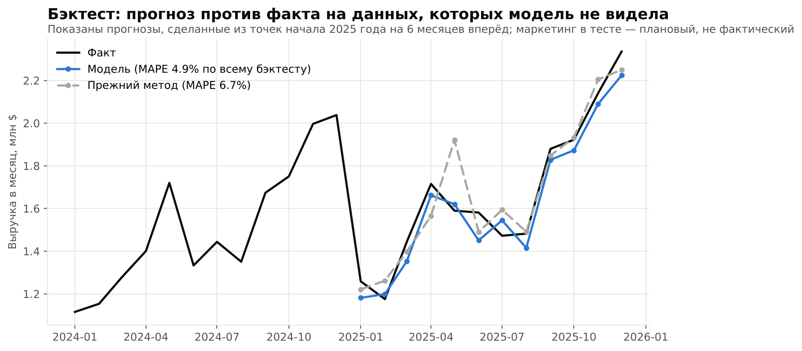

# Прогноз на scikit-learn для бизнеса с оборотом $20 млн: как перестать планировать «по прошлому году»

> **Важно: это модельный пример на синтетических данных, а не результат реального клиента.** Условная компания и её данные созданы мной, чтобы показать метод, порядок цифр и типичные проблемы малого бизнеса. Реальный эффект зависит от ваших данных, и его проверяют на пилоте.

---

## Условная задача

Оптовый дистрибьютор с оборотом ≈ $20 млн в год планирует закупки по формуле «прошлый год плюс рост». Пока рынок спокоен, это работает. Но на практике:

- весенняя акция каждый год проходит в разные месяцы (март, апрель, май), и прогноз «как в прошлом году» промахивается;
- в одни месяцы на складе дефицит, в другие — замороженные деньги;
- непонятно, окупается ли увеличение маркетингового бюджета.

**Цель:** помесячный прогноз выручки на 12 месяцев с диапазоном неопределённости и сценариями «что если».

## Данные

Помесячная выгрузка за 48 месяцев (2022–2025):

| Показатель | Роль |
|---|---|
| Выручка | целевая переменная |
| Маркетинговый бюджет | драйвер спроса |
| Календарь акций | драйвер спроса |
| Число рабочих дней | календарный эффект |

## Обработка данных

В синтетическую выгрузку я намеренно внёс дефекты, которые встречаются почти в любой реальной:

- **1 дубль строки** — удалён;
- **3 пропуска** в маркетинговом бюджете — линейная интерполяция;
- **1 выброс** (ошибка ввода выручки ×10) — найден и заменён.

Выбросы искал не по «скачку к соседнему месяцу»: при таком подходе сезонные пики Q4 принимались бы за ошибки. Искал в остатках после вычета тренда и сезонности. Первая версия детектора (порог 4 MAD) дала ложное срабатывание на обычный месяц, поэтому порог поднят до 6 MAD. Подбор порога на тех же данных — слабое место, о нём в ограничениях.

**Ключевой приём — предсказывать не уровень выручки, а годовое изменение (YoY).** Модель смотрит, что изменилось по сравнению с тем же месяцем прошлого года: сдвинулась ли акция, изменился ли бюджет, сколько рабочих дней. Тренд и сезонность уже заложены в базу, а модель учится только на изменениях драйверов. Для 4 лет данных это разумнее «тяжёлой» модели. Минус подхода: шум базового месяца переносится в прогноз.

## Методы (scikit-learn)

1. **Базовая линия:** «прошлый год × рост». Так планировали раньше. Любая модель должна её побеждать.
2. **Ridge-регрессия** — простая, интерпретируемая, видно вклад каждого драйвера.
3. **GradientBoostingRegressor** — для нелинейностей.
4. **Ансамбль** Ridge + Boosting.

**Валидация:** скользящий бэктест. Модель обучается только на данных «до» и прогнозирует следующие 6 месяцев, 7 раз с шагом в 3 месяца. Случайная перемешивающая кросс-валидация для временных рядов не подходит: она «подглядывает в будущее». В тесте маркетинговый бюджет — **плановый** (прошлый год +5%), а не фактический: в реальности мы знаем план, а не факт.

**Результат бэктеста:** ошибка (MAPE) снизилась с **6,7% до 4,9%**. В старом методе занижение спроса более чем на 10% случилось в 5 из 42 прогнозов, у модели — в 2 из 42. Выборка маленькая и прогнозы перекрываются по времени, поэтому это ориентир, а не гарантия. Ансамбль показал почти то же качество, что Ridge (в пределах шума), поэтому для работы выбрана простая Ridge.

## Прогноз и выводы

- Выручка 2026: **≈ $21,6 млн (+8% к 2025)**. Декабрьский пик ≈ $2,55 млн.
- Интервал 80% построен по реальным ошибкам бэктеста, он ориентировочный и несимметричный: в тесте модель чаще занижала, чем завышала. На 42 ошибках неопределённость, скорее всего, недооценена.
- Ноябрь и декабрь дают +30% и +28% к среднему месяцу, январь–февраль — около −22%. Закупки и персонал планируются под эту форму года.

- Промо-акция даёт ≈ **+11%** к выручке месяца. Увеличение маркетингового бюджета на 10% связано лишь с **≈ +1%** выручки (это корреляция в истории, а не доказанная причинность).

## Что это даёт бизнесу (в модельном примере)

| | Прежний метод | Модель |
|---|---|---|
| Средняя ошибка прогноза (MAPE) | 6,7% | 4,9% |
| Месяцы с занижением спроса >10% (в бэктесте) | 5 из 42 | 2 из 42 |
| Расчётный страховой запас | ≈ $175 тыс. | ≈ $115 тыс. |

**1. Меньше замороженных денег.** Страховой запас пропорционален ошибке прогноза. При сервис-уровне 95%, сроке поставки 1 месяц и себестоимости 72% выручки расчётный запас снижается примерно на **$60 тыс.**. Это **разовое** высвобождение оборотных средств, а не годовая экономия. Оценка считалась по выручке компании в целом: по отдельным товарам ошибка выше, и реальный эффект придётся считать на уровне SKU.

**2. Меньше дефицитов.** Реже занижается спрос — меньше месяцев, когда товара не хватает.

**3. Решение по бюджету — до того, как деньги потрачены.** Сценарий «+20% маркетинга в сентябре–ноябре» даёт по модели ≈ +$127 тыс. выручки (≈ +2%). При марже 28% это ≈ $36 тыс. валовой прибыли против $84 тыс. дополнительных затрат. Эффект рассчитан без лагов, поэтому это ориентир, но направление ясно: **такое увеличение, по всей видимости, не окупается**, и деньги стоит проверять на более эффективных инструментах.

## Ограничения

- 48 наблюдений — немного. Поэтому выбраны простые модели и YoY-подход.
- Данные синтетические: на реальных данных точность будет иной, обычно хуже. Порог выбросов и модель подбирались на тех же 48 месяцах.
- Прогноз зависит от плана маркетинга и акций, их нужно знать заранее.
- Модель не предскажет внешний шок (новый конкурент, сбой поставок). Для этого — интервалы и сценарии.
- Модель нужно переобучать раз в квартал и следить за ошибкой на новых данных.

## Чем могу помочь

- Аудит данных и постановка прогнозной задачи под вашу метрику (выручка, спрос по SKU, отток клиентов).
- Модель на Python / scikit-learn с честной валидацией и понятными выводами.
- Сценарный анализ «что если» и отчёт для руководства — без «чёрного ящика».
- Передача решения: код, документация, обучение команды.

**Хотите понять, что прогнозирование даст вашему бизнесу?** Напишите мне в личные сообщения: обсудим ваши данные и задачу.

*#DataScience #Forecasting #scikitlearn #SmallBusiness #Analytics*
