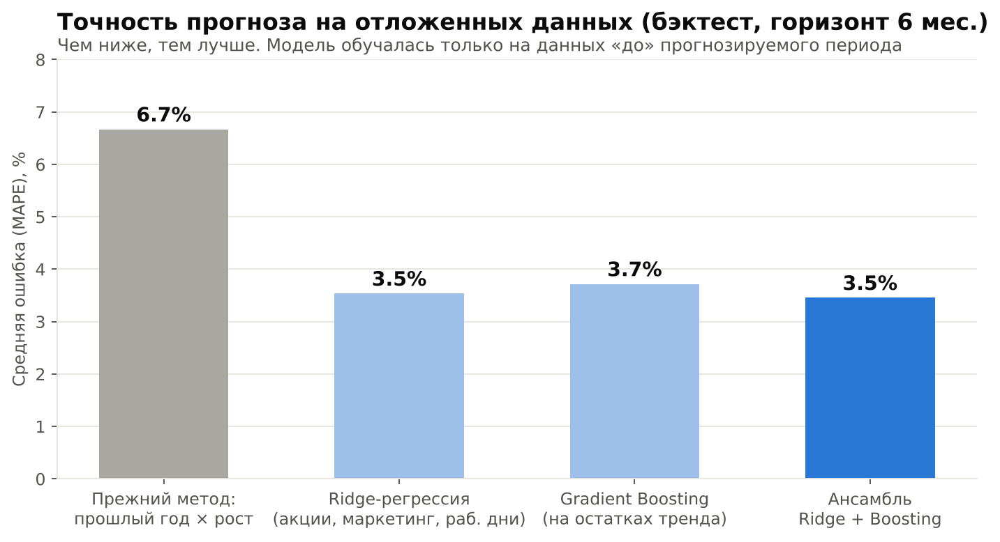
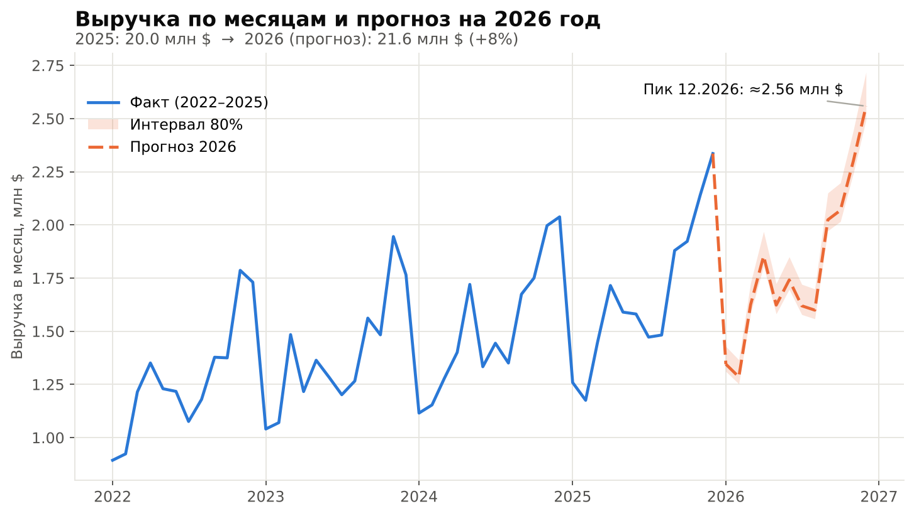
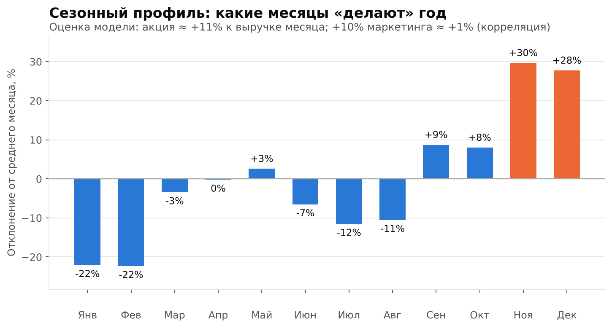
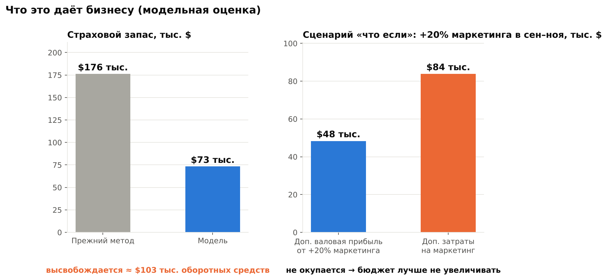

# Как прогноз на scikit-learn помогает бизнесу на $20 млн планировать закупки и маркетинг

*Иллюстративный кейс: оптовый дистрибьютор, оборот ≈ $20 млн в год. Компания и данные в этом примере синтетические. Они воспроизводят типичные проблемы малого бизнеса, чтобы показать метод и порядок цифр. Все скрипты воспроизводимы.*

---

## Задача заказчика

Оптовая компания (≈ $20 млн выручки, ≈ 50 сотрудников) планировала закупки «по прошлому году плюс рост». Это работает, пока рынок спокоен. Но:

- весенняя акция каждый год проходит в разные месяцы (март, апрель, май), и прогноз «как в прошлом году» промахивается;
- в месяцы с недозагрузкой склада возникают дефициты, в месяцы с избытком — замороженные деньги;
- непонятно, окупается ли увеличение маркетингового бюджета.

**Что нужно было получить:** помесячный прогноз выручки на 12 месяцев с понятным диапазоном неопределённости и возможностью смотреть сценарии «что если».

## Какие данные были

Выгрузка из учётной системы за 48 месяцев (2022–2025):

| Показатель | Зачем нужен |
|---|---|
| Выручка по месяцам | целевая переменная |
| Маркетинговый бюджет | драйвер спроса |
| Календарь акций | драйвер спроса |
| Число рабочих дней | календарный эффект |

## Как обрабатывали данные

Реальные выгрузки грязные, и эта не исключение. Нашли и исправили:

- **1 дубль строки**, удалён;
- **3 пропуска** в маркетинговом бюджете, заполнены линейной интерполяцией;
- **2 выброса** (ошибка ввода выручки ×10). Выбросы искали не по «скачку к соседнему месяцу», иначе сезонные пики Q4 принимались бы за ошибки. Искали в остатках после вычета тренда и сезонности (порог 4 MAD).

Главный методический приём — **предсказывать не уровень выручки, а годовое изменение** (YoY). Модель смотрит на то, что изменилось по сравнению с тем же месяцем год назад: сдвинулась ли акция, изменился ли бюджет, сколько рабочих дней. Так тренд и сезонность уже «зашиты» в базу, а модель учится только на изменениях драйверов. Это важно на малой выборке в 4 года.

## Какие методы использовали (scikit-learn)

1. **Базовая линия** — «прошлый год × рост». Так компания планировала раньше. Любая модель должна её побеждать, иначе она не нужна.
2. **Ridge-регрессия** — интерпретируемая: видно вклад каждого драйвера.
3. **GradientBoostingRegressor** — ловит нелинейности.
4. **Ансамбль** Ridge + Boosting.

**Валидация без самообмана:** скользящий бэктест. Модель обучается только на данных «до» и прогнозирует следующие 6 месяцев, так 7 раз с шагом в 3 месяца. Случайное перемешивание для временных рядов не годится: оно «подглядывает в будущее» и завышает качество. Интервал прогноза (80%) строится из реальных ошибок бэктеста, а не из допущения о нормальности.

**Результат:** средняя ошибка (MAPE) снизилась с **6,7% до 3,5%**. Доля месяцев, когда спрос недооценивался более чем на 10%, снизилась с **12% до 0%** в тесте.

## Что показал прогноз

- Выручка 2026: **≈ $21,6 млн (+8% к 2025)**. Пик в декабре — ≈ $2,56 млн.
- Ноябрь и декабрь дают +30% и +28% к среднему месяцу, январь и февраль — около −22%. Закупки и персонал стоит планировать под эту форму года.

- Модель оценила эффект промо-акции в **≈ +11%** к выручке месяца. Эффект маркетинга скромнее: **+10% бюджета ≈ +1% выручки**.

## Что это даёт бизнесу

**1. Меньше замороженных денег.** Точность прогноза определяет, сколько страхового запаса нужно держать. При прочих равных (сервис-уровень 95%) расчётный страховой запас снижается с ≈ $176 тыс. до ≈ $73 тыс. Это **≈ $100 тыс. оборотных средств**, высвобождаемых при сохранении уровня сервиса.

**2. Меньше дефицитов.** В бэктесте старый метод в каждом восьмом месяце занижал спрос больше чем на 10%, то есть это месяцы потенциальных потерь продаж. У модели таких месяцев не было.

**3. Решение по бюджету — до того, как потрачены деньги.** Сценарий «+20% маркетинга в сентябре–ноябре» даёт ≈ +$173 тыс. выручки. При марже 28% это ≈ $48 тыс. валовой прибыли против $84 тыс. дополнительных затрат. То есть **такое увеличение не окупается**. Деньги разумнее направить в календарь акций, чья отдача по модели заметно выше.

> Важная оговорка: оценка эффекта маркетинга — это корреляция в исторических данных, а не доказанная причинность. Для крупных решений её стоит подтверждать контролируемым тестом.

## Ограничения (честно)

- 48 наблюдений — это немного. Поэтому выбраны простые, интерпретируемые модели и YoY-подход, а не «тяжёлая» нейросеть.
- Прогноз хорош, пока бизнес-условия похожи на историю. Крупный внешний шок (новый конкурент, сбой поставок) модель не предскажет, но интервал и сценарии помогают к нему готовиться.
- Экономия запасов — модельная оценка при допущениях (95% сервис, ошибка прогноза как основной источник неопределённости). Реальный эффект проверяется на пилоте.
- Модель нужно переобучать минимум раз в квартал и отслеживать ошибку на новых данных.

## Что делаю для клиентов

- Аудит данных и постановка прогнозной задачи под вашу бизнес-метрику (выручка, спрос по SKU, отток клиентов).
- Модель на Python / scikit-learn с честной валидацией и понятными выводами.
- Сценарный анализ «что если» и отчёт для руководства — без «чёрного ящика».
- Передача решения: код, документация, обучение вашей команды.

**Хотите оценить, что даст прогнозирование вашему бизнесу?** Напишите мне в личные сообщения. Начнём с бесплатной 30-минутной оценки ваших данных.

*#DataScience #Forecasting #scikitlearn #SmallBusiness #Analytics*
