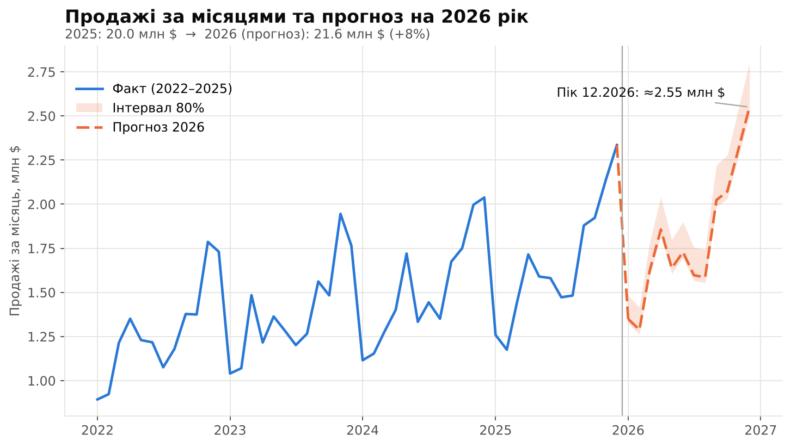

# Прогнозування попиту для виробництва на scikit-learn

[🇬🇧 English](README.md) · 🇺🇦 Українська

Наскрізний приклад помісячного прогнозу продажів для середнього виробничого підприємства (близько **$20 млн** на рік): очищення даних, ковзний бектест проти правила «минулий рік × зростання», 12-місячний прогноз із діапазоном невизначеності та сценарій «що якщо» для маркетингу.

> **Усі дані в цьому репозиторії синтетичні, компанія вигадана.** Код демонструє метод і порядок результатів; це **не** результат реального клієнта. На реальних даних результати будуть іншими, зазвичай гіршими.



## Ключові результати (на синтетичних даних)

| | Старий метод («минулий рік × зростання») | Модель Ridge |
|---|---|---|
| Середня похибка прогнозу (MAPE, ковзний бектест) | 6,7% | 4,9% |
| Місяці із заниженням попиту >10% | 5 із 42 | 2 із 42 |
| Розрахунковий страховий запас готової продукції | ≈ $175 тис. | ≈ $115 тис. (разово вивільняється ≈ $60 тис.) |

Прогноз на 2026: ≈ **$21,6 млн** (+8%). Сценарій «+20% маркетингу у вер–лис» дає ≈ $36 тис. валового прибутку за $84 тис. витрат, тобто в цьому прикладі не окупається.

## Як це працює

1. **Синтетичне вивантаження з ERP:** 48 місяців продажів, маркетинговий бюджет, календар акцій і робочі дні, з навмисними дефектами (1 дубль, 3 пропуски, 1 викид ×10).
2. **Очищення:** видалення дублів, інтерполяція, пошук викидів у залишках після вилучення тренду й сезонності (6 MAD).
3. **Ціль — річна зміна (YoY).** Моделі прогнозують `log(sales_t / sales_{t-12})` за змінами драйверів (прапорець акції, log маркетингового бюджету, log робочих днів).
4. **Моделі:** наївна базова лінія, `Ridge`, `GradientBoostingRegressor`, ансамбль 50/50.
5. **Валідація:** ковзний бектест, горизонт 6 місяців, 7 точок початку, крок 3 місяці; у тесті маркетинг — *план* (минулий рік +5%), а не факт.
6. **Прогноз:** 2026, інтервал 80% за емпіричними логарифмічними похибками бектесту.
7. **Переклад у бізнес-ефект:** страховий запас = `z · RMSE · місячна собівартість` (z = 1,65, термін поставки 1 міс., собівартість 72% продажів) та сценарій «що якщо» для маркетингу при валовій маржі 28%.

## Запуск

```bash
python3 -m venv .venv && source .venv/bin/activate
pip install -r requirements.txt
python3 src/forecast.py          # запускати з кореня репозиторію
```

Скрипт детермінований (фіксований seed) і перезаписує `data/`, `results/` та `charts/{en,uk}/`.

## Структура репозиторію

```
.
├── README.md / README.uk.md
├── LICENSE
├── requirements.txt
├── src/forecast.py              # весь конвеєр: дані, очищення, моделі, бектест, графіки
├── data/
│   ├── raw_export.csv           # синтетичне вивантаження з доданими дефектами
│   └── clean_data.csv           # після очищення
├── results/
│   ├── backtest_summary.csv     # метрики за моделями
│   ├── backtest_detail.csv      # усі прогнози бектесту
│   ├── forecast_2026.csv        # прогноз з інтервалом 80%
│   └── results.json             # ключові числа зі статей
├── charts/{en,uk}/              # по 5 графіків на мову
└── articles/                    # повні тексти статей (EN, UK)
```

## Обмеження

- Синтетичні дані; лише 48 місячних спостережень.
- Поріг викидів і вибір моделі підбирались на тих самих даних; окремої відкладеної вибірки немає.
- Інтервал 80% побудовано з 42 перекритих похибок бектесту, імовірно він занадто вузький.
- Ефект маркетингу — кореляція в (синтетичній) історії, а не доведена причинність, і розрахований без часових лагів.
- Оцінка страхового запасу — за продажами компанії в цілому; за окремими SKU похибка вища, тож реальну економію слід рахувати по SKU.
- Прогноз залежить від того, що план маркетингу й акцій відомий заздалегідь.

## Статті

- [English article](articles/article.en.md)
- [Українська стаття](articles/article.uk.md)
- LinkedIn: _додайте тут посилання на опубліковану статтю_

## Ліцензія

[MIT](LICENSE)
