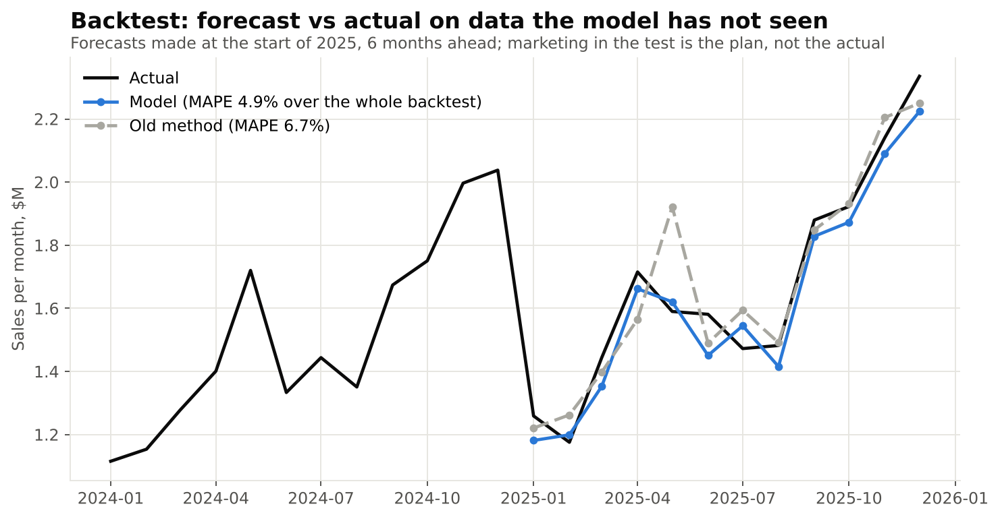
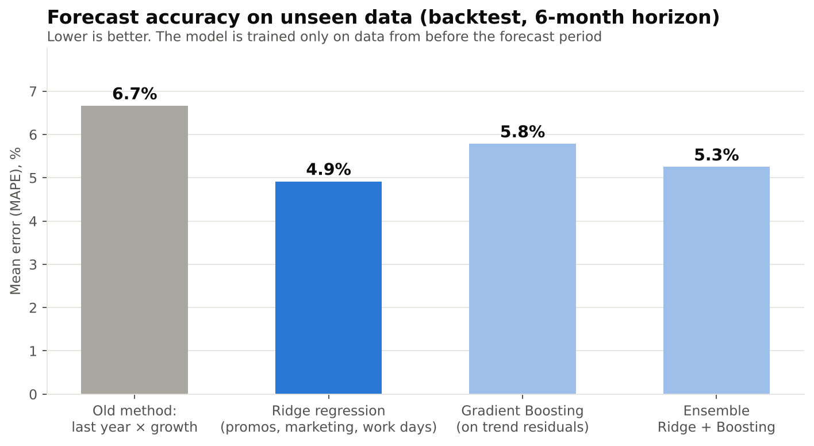
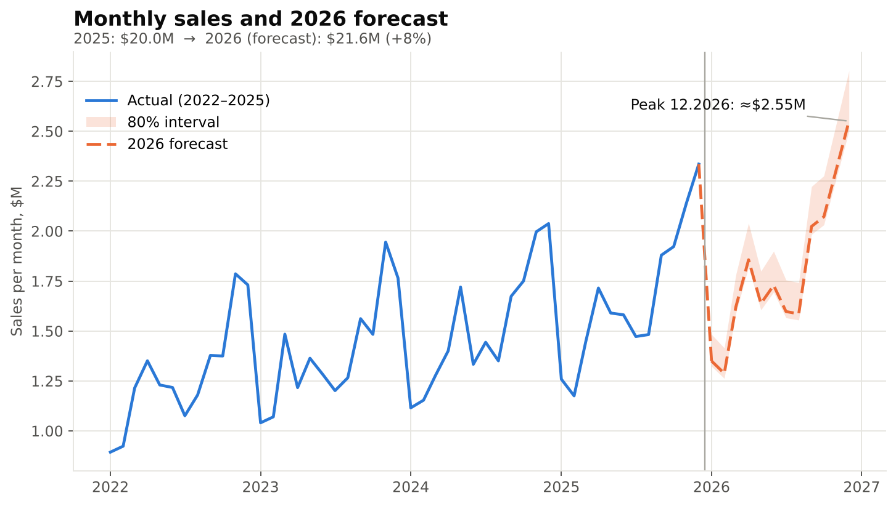
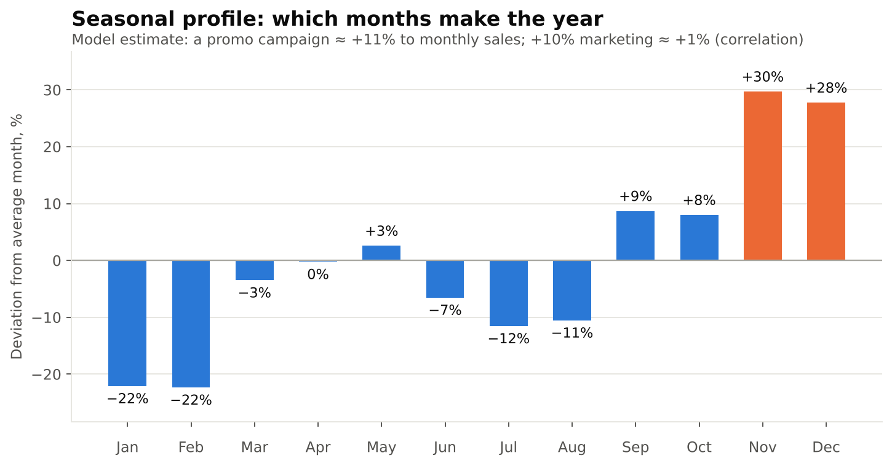
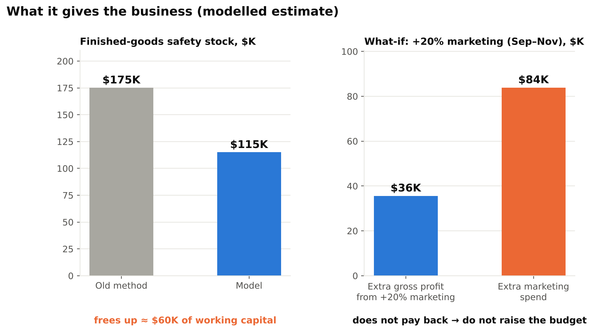

# Demand forecasting with scikit-learn for a $20M manufacturer: stop planning production "by last year"

> **Note: this is a modelled example on synthetic data, not the result of a real client engagement.** The company and its data were created to demonstrate the method, the order of magnitude of the numbers, and the typical problems of a small manufacturer. Real results depend on your data and should be verified in a pilot.

---

## The (hypothetical) problem

A mid-size manufacturer with about $20M in annual sales plans production and raw-material purchases using a simple rule: "last year plus growth". It works while the market is calm. In practice:

- the spring customer promotion moves between March, April and May from year to year, so "same as last year" misses;
- in some months the finished-goods warehouse runs out of product, in others cash is frozen in stock;
- raw materials have lead times, so a wrong forecast turns into either a production stop or excess inventory;
- it is unclear whether raising the marketing budget pays back.

**Goal:** a monthly sales forecast for the next 12 months with an uncertainty range and "what-if" scenarios that feed the production and purchasing plan.

## Data

A monthly export for 48 months (2022–2025):

| Metric | Role |
|---|---|
| Sales (revenue) | target variable |
| Marketing budget | demand driver |
| Promotion calendar | demand driver |
| Number of working days | production / calendar effect |

## Data preparation

I deliberately injected defects typical of almost any real ERP export into the synthetic data:

- **1 duplicate row**: removed;
- **3 gaps** in the marketing budget: linear interpolation;
- **1 outlier** (a ×10 data-entry error in sales): detected and replaced.

I did not detect outliers as "a jump versus the neighbouring month": that would flag the normal Q4 seasonal peaks as errors. Instead I looked at residuals after removing trend and seasonality. The first version of the detector (threshold 4 MAD) produced a false positive on a normal month, so I raised the threshold to 6 MAD. Tuning a threshold on the same data is a weakness; see Limitations.

**The key technique: predict the year-over-year change, not the level.** The model looks at what changed versus the same month last year: did the promotion move, did the budget change, how many working days are there. Trend and seasonality are already in the base, and the model learns only from changes in the drivers. With four years of data this is more sensible than a "heavy" model. The downside: the noise of the base month is carried into the forecast.

## Methods (scikit-learn)

1. **Baseline:** "last year × growth", the old planning rule. Any model must beat it.
2. **Ridge regression**: simple and interpretable; you can see each driver's contribution.
3. **GradientBoostingRegressor**: for non-linear effects.
4. **Ensemble** of Ridge + Boosting.

**Validation:** rolling-origin backtest. The model is trained only on data from before the forecast period and predicts the next 6 months, 7 times with a 3-month step. Shuffled cross-validation is not appropriate for time series because it "peeks into the future". In the test the marketing budget is the **plan** (last year +5%), not the actual figure, because in real life you know the plan, not the outcome.

**Backtest result:** the error (MAPE) fell from **6.7% to 4.9%**. With the old method, demand was under-forecast by more than 10% in 5 of 42 forecasts; with the model, in 2 of 42. The sample is small and the forecasts overlap in time, so treat this as a guideline, not a guarantee. The ensemble performed about the same as Ridge (within noise), so the simple Ridge model was chosen.

## Forecast and findings

- 2026 sales: **≈ $21.6M (+8% vs 2025)**. The December peak is ≈ $2.55M.
- The 80% interval is built from real backtest errors. It is approximate and asymmetric: in the test the model under-forecast more often than it over-forecast. With only 42 errors, the uncertainty is most likely underestimated.
- **What it means for production:** Q4 accounts for ≈ 41% of annual sales; the peak month is ≈ 1.4× the average month and the weakest month ≈ 0.7×. Capacity, shifts, raw-material orders and pre-building of finished goods should be planned around this shape.

- A promo campaign adds ≈ **+11%** to monthly sales. A 10% higher marketing budget is associated with only **≈ +1%** (a correlation in history, not proven causation).

## What it gives the business (in the modelled example)

| | Old method | Model |
|---|---|---|
| Mean forecast error (MAPE) | 6.7% | 4.9% |
| Months with demand under-forecast by >10% (backtest) | 5 of 42 | 2 of 42 |
| Calculated finished-goods safety stock | ≈ $175K | ≈ $115K |

**1. Less cash frozen in stock.** Safety stock is proportional to forecast error. At a 95% service level, a 1-month lead time and cost of goods at 72% of sales, the calculated safety stock drops by about **$60K**. This is a **one-off** release of working capital, not an annual saving. It was calculated on total company sales; at SKU level the error is higher, so the real effect must be calculated per SKU.

**2. Fewer stock-outs.** Demand is under-forecast less often, so there are fewer months in which products are missing.

**3. A budget decision before the money is spent.** The scenario "+20% marketing in September–November" adds ≈ $127K of sales (≈ +2%) according to the model. At a 28% gross margin that is ≈ $36K of gross profit against $84K of extra spend. The effect is calculated without time lags, so it is a guideline, but the direction is clear: **such an increase most likely does not pay back**, and the money should be tested on more effective instruments.

## Limitations

- 48 observations is not much, so simple models and the YoY approach were chosen.
- The data is synthetic: on real data accuracy will differ, usually for the worse. The outlier threshold and the model were tuned on the same 48 months.
- The forecast depends on the marketing and promotion plan, which must be known in advance.
- The model will not predict an external shock (a new competitor, a supply disruption). That is what intervals and scenarios are for.
- The model should be retrained quarterly and its error monitored on new data.

## How I can help

- Data audit and framing the forecasting task around your business metric (sales, SKU demand, customer churn).
- A Python / scikit-learn model with honest validation and clear conclusions.
- What-if analysis and a report for management, with no "black box".
- Handover: code, documentation and training for your team.

**Want to understand what forecasting could do for your business?** Message me and we will talk through your data and your task.

*#DataScience #Forecasting #scikitlearn #Manufacturing #SupplyChain #Analytics*
