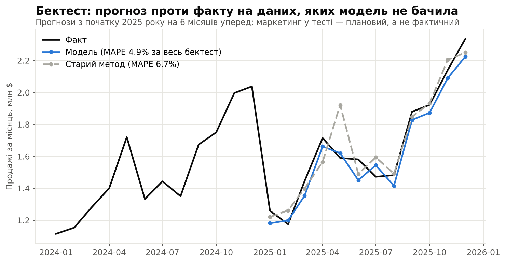
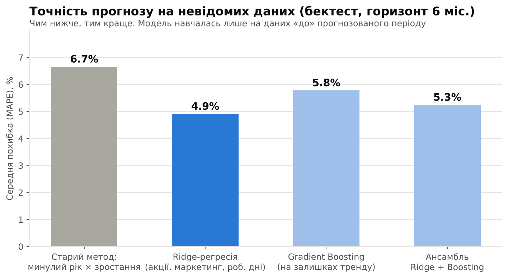
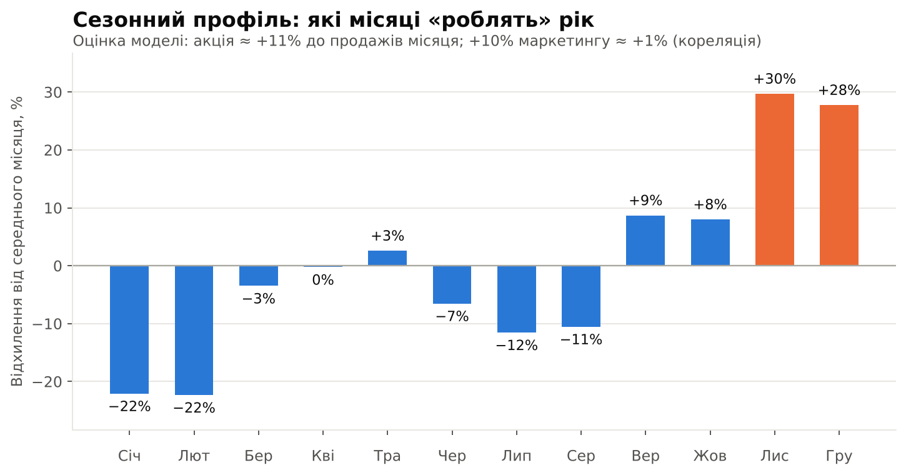
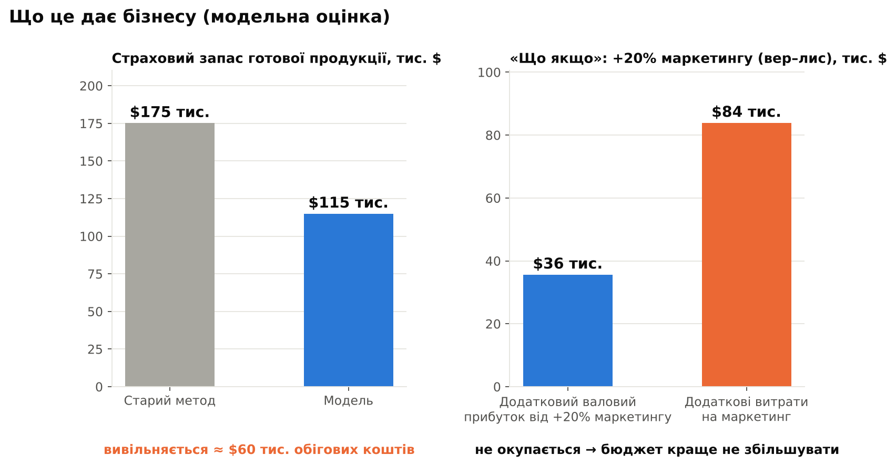

# Прогнозування попиту на scikit-learn для виробництва з оборотом $20 млн: годі планувати «за минулим роком»

> **Важливо: це модельний приклад на синтетичних даних, а не результат реального клієнта.** Умовну компанію та її дані створено, щоб показати метод, порядок цифр і типові проблеми малого виробництва. Реальний ефект залежить від ваших даних і перевіряється на пілоті.

---

## Умовна задача

Середнє виробниче підприємство з річними продажами ≈ $20 млн планує виробництво й закупівлю сировини за простим правилом: «минулий рік плюс зростання». Поки ринок спокійний, це працює. Але на практиці:

- весняна акція для клієнтів щороку «гуляє» між березнем, квітнем і травнем, тому «як торік» не влучає;
- в одні місяці на складі готової продукції не вистачає товару, в інші — гроші заморожені в запасах;
- сировина має терміни поставки, тож помилка прогнозу перетворюється або на простій виробництва, або на надлишки;
- незрозуміло, чи окупається збільшення маркетингового бюджету.

**Мета:** помісячний прогноз продажів на 12 місяців із діапазоном невизначеності та сценаріями «що якщо», які живлять план виробництва і закупівель.

## Дані

Помісячне вивантаження за 48 місяців (2022–2025):

| Показник | Роль |
|---|---|
| Продажі (виручка) | цільова змінна |
| Маркетинговий бюджет | драйвер попиту |
| Календар акцій | драйвер попиту |
| Кількість робочих днів | виробничий / календарний ефект |

## Підготовка даних

У синтетичне вивантаження я навмисно додав дефекти, типові майже для будь-якої реальної вигрузки з ERP:

- **1 дубль рядка** — видалено;
- **3 пропуски** в маркетинговому бюджеті — лінійна інтерполяція;
- **1 викид** (помилка введення продажів ×10) — знайдено і замінено.

Викиди я шукав не за «стрибком відносно сусіднього місяця»: так сезонні піки Q4 сприймались би як помилки. Натомість аналізував залишки після вилучення тренду та сезонності. Перша версія детектора (поріг 4 MAD) дала хибне спрацювання на звичайний місяць, тому поріг піднято до 6 MAD. Підбір порога на тих самих даних — слабке місце, див. «Обмеження».

**Ключовий прийом — прогнозувати не рівень продажів, а річну зміну (YoY).** Модель дивиться, що змінилося порівняно з тим самим місяцем минулого року: чи зсунулась акція, чи змінився бюджет, скільки робочих днів. Тренд і сезонність уже закладено в базу, а модель вчиться лише на змінах драйверів. Для 4 років даних це розумніше за «важку» модель. Мінус підходу: шум базового місяця переноситься в прогноз.

## Методи (scikit-learn)

1. **Базова лінія:** «минулий рік × зростання» — так планували раніше. Будь-яка модель має її перемагати.
2. **Ridge-регресія** — проста, інтерпретована, видно внесок кожного драйвера.
3. **GradientBoostingRegressor** — для нелінійних ефектів.
4. **Ансамбль** Ridge + Boosting.

**Валідація:** ковзний бектест. Модель навчається лише на даних «до» прогнозованого періоду та прогнозує наступні 6 місяців, 7 разів із кроком у 3 місяці. Перемішана крос-валідація для часових рядів не підходить: вона «підглядає в майбутнє». У тесті маркетинговий бюджет — **плановий** (минулий рік +5%), а не фактичний: у реальності ми знаємо план, а не результат.

**Результат бектесту:** похибка (MAPE) зменшилась із **6,7% до 4,9%**. За старим методом попит занижувався більш ніж на 10% у 5 із 42 прогнозів, у моделі — у 2 із 42. Вибірка мала, а прогнози перекриваються в часі, тож це орієнтир, а не гарантія. Ансамбль показав майже те саме, що й Ridge (у межах шуму), тому обрано просту Ridge.

## Прогноз і висновки

- Продажі 2026: **≈ $21,6 млн (+8% до 2025)**. Грудневий пік ≈ $2,55 млн.
- Інтервал 80% побудовано за реальними похибками бектесту. Він орієнтовний і несиметричний: у тесті модель частіше занижувала, ніж завищувала. На 42 похибках невизначеність, найімовірніше, недооцінено.
- **Що це означає для виробництва:** на Q4 припадає ≈ 41% річних продажів; піковий місяць ≈ 1,4× середнього, найслабший ≈ 0,7×. Потужності, зміни, замовлення сировини та випередне виробництво готової продукції варто планувати під цю форму року.

- Промо-акція дає ≈ **+11%** до продажів місяця. Збільшення маркетингового бюджету на 10% пов’язане лише з **≈ +1%** (це кореляція в історії, а не доведена причинність).

## Що це дає бізнесу (в модельному прикладі)

| | Старий метод | Модель |
|---|---|---|
| Середня похибка прогнозу (MAPE) | 6,7% | 4,9% |
| Місяці із заниженням попиту >10% (бектест) | 5 із 42 | 2 із 42 |
| Розрахунковий страховий запас готової продукції | ≈ $175 тис. | ≈ $115 тис. |

**1. Менше заморожених коштів.** Страховий запас пропорційний похибці прогнозу. За сервіс-рівня 95%, терміну поставки 1 місяць і собівартості 72% від продажів розрахунковий запас зменшується приблизно на **$60 тис.**. Це **разове** вивільнення обігових коштів, а не річна економія. Рахувалось за продажами компанії в цілому: за окремими позиціями похибка вища, тож реальний ефект треба рахувати на рівні SKU.

**2. Менше дефіциту.** Попит рідше занижується — менше місяців, коли товару не вистачає.

**3. Рішення щодо бюджету — до того, як гроші витрачено.** Сценарій «+20% маркетингу у вересні–листопаді» дає за моделлю ≈ +$127 тис. продажів (≈ +2%). За валової маржі 28% це ≈ $36 тис. валового прибутку проти $84 тис. додаткових витрат. Ефект розрахований без часових лагів, тож це орієнтир, але напрям зрозумілий: **таке збільшення, імовірно, не окупається**, а гроші варто перевіряти на ефективніших інструментах.

## Обмеження

- 48 спостережень — небагато, тому обрано прості моделі та підхід YoY.
- Дані синтетичні: на реальних даних точність буде іншою, зазвичай гіршою. Поріг викидів і модель підбирались на тих самих 48 місяцях.
- Прогноз залежить від плану маркетингу та акцій, який треба знати заздалегідь.
- Модель не передбачить зовнішній шок (новий конкурент, збій поставок). Для цього — інтервали та сценарії.
- Модель слід перенавчати щокварталу й стежити за похибкою на нових даних.

## Чим можу допомогти

- Аудит даних і постановка прогнозної задачі під вашу метрику (продажі, попит за SKU, відтік клієнтів).
- Модель на Python / scikit-learn з чесною валідацією та зрозумілими висновками.
- Сценарний аналіз «що якщо» та звіт для керівництва — без «чорної скриньки».
- Передача рішення: код, документація, навчання вашої команди.

**Хочете зрозуміти, що прогнозування дасть вашому бізнесу?** Напишіть мені в особисті повідомлення: обговоримо ваші дані та задачу.

*#DataScience #Forecasting #scikitlearn #Manufacturing #SupplyChain #Analytics*
